# wavlm_ssl_sv

This repository contains the source code of the article **Towards Supervised Performance on Speaker Verification with Self-Supervised Learning by Leveraging Large-Scale ASR Models** (INTERSPEECH 2024) [[arXiv]](https://arxiv.org/pdf/2406.02285).

The proposed framework fine-tunes a pre-trained **WavLM** using pseudo-labels, generated through **Self-Supervised Learning** (SSL), for **Speaker Verification** (SV). Initial pseudo-labels are derived from an SSL DINO-based model and are iteratively refined by clustering the model embeddings.

<p align="center">
  
</p>

Our method achieves **0.99% EER on VoxCeleb1-O**, establishing the new SOTA on Speaker Verification with SSL.

*Please refer to the article for more details on the implementation and a comparative study with other works.*

---

## Usage

### Installation

- Install dependencies with `pip install -r requirements.txt`.
- Prepare data for VoxCeleb, MUSAN, and RIR datasets following [voxceleb_trainer](https://github.com/clovaai/voxceleb_trainer#data-preparation).
- Download [WavLM-Base+ model](https://github.com/microsoft/unilm/tree/master/wavlm) and place `WavLM-Base+.pt` at the root folder.

### Training

#### Step 1: Extract DINO speaker embeddings

The code to train the DINO model is not currently provided. We recommend using [sslsv](https://github.com/theolepage/sslsv) or [3D-Speaker](https://github.com/modelscope/3D-Speaker) to extract initial speaker embeddings.

Alternatively, you can directly download the DINO embeddings we used for our system: [dino_vox2_embeddings.pt](https://drive.google.com/file/d/1YnxrMIgrr6NQgZ3Hv2_5YdP5W8xfdyLH/view?usp=sharing).

*Note: the embeddings file must be a `Dict[str, torch.Tensor]` representing all VoxCeleb2 samples with the following format for keys: `id00012/21Uxsk56VDQ/00001.wav`.*

#### Step 2: Generate pseudo-labels

```bash
python pseudo_labeling.py PATH_TO_EMBEDDINGS_FILE PATH_TO_PL_FILE
```

#### Step 3: Fine-tune WavLM MHFA

```bash
python trainSpeakerNet.py --config configs/wavlm_mhfa_dlg_lc.yaml --train_list PATH_TO_PL_FILE --distributed
```

#### Iterative process

1. Extract embeddings from the WavLM MHFA model:
  `python trainSpeakerNet_Eval.py --config configs/wavlm_mhfa_dlg_lc.yaml --generate_embeddings --embeddings_path PATH_TO_EMBEDDINGS_FILE`.

2. Repeat steps 2 and 3. *Make sure to change `save_path` in the config to avoid overwriting the existing model.*

#### Step 4: Large-Margin Fine-Tuning

1. Copy the latest model checkpoint to `exp/wavlm_mhfa_dlg_lc_lmft/model` to resume training.

2. Start training: `python trainSpeakerNet.py --config configs/wavlm_mhfa_dlg_lc_lmft.yaml --train_list PATH_TO_PL_FILE --distributed`.

### Evaluation

```bash
python trainSpeakerNet_Eval.py --config configs/wavlm_mhfa_dlg_lc_lmft.yaml --eval
```

### Model weights

The checkpoint of our best model reaching 0.99% EER on VoxCeleb1-O is available for download: [`wavlm_mhfa_dlg_lc_lmft`](https://drive.google.com/drive/folders/1ygZPvdGwepWDDfIQp6aPRktt2QxLt6cE?usp=drive_link).

---

## Acknowledgements

This repository contains third-party components and code adapted from other open-source projects, including: [SLT22_MultiHead-Factorized-Attentive-Pooling](https://github.com/JunyiPeng00/SLT22_MultiHead-Factorized-Attentive-Pooling) and [Loss-Gated-Learning](https://github.com/TaoRuijie/Loss-Gated-Learning).

---

## Citation

If you use this project, please consider starring this repository on GitHub and citing the following paper.

```BibTeX
@InProceedings{miara2024WavLMSSLSV,
  author    = {Miara, Victor and Lepage, Théo and Dehak, Réda},
  booktitle = {INTERSPEECH},
  title     = {Towards Supervised Performance on Speaker Verification with Self-Supervised Learning by Leveraging Large-Scale ASR Models},
  year      = {2024},
  url       = {https://arxiv.org/abs/2406.02285},
}
```

---

## License

This project is released under the [MIT License](https://github.com/theolepage/wavlm_ssl_sv/blob/main/LICENSE.md).
